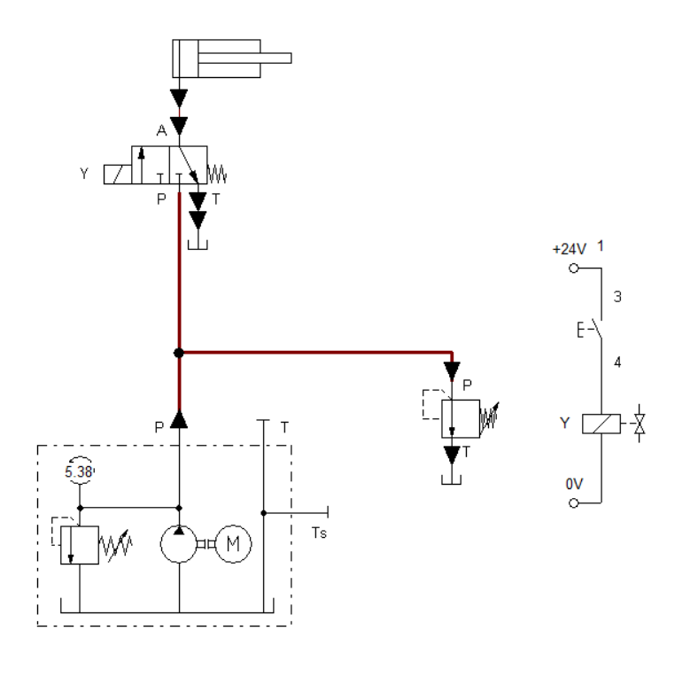
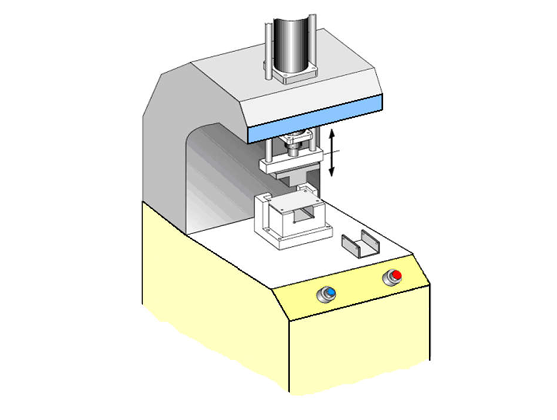
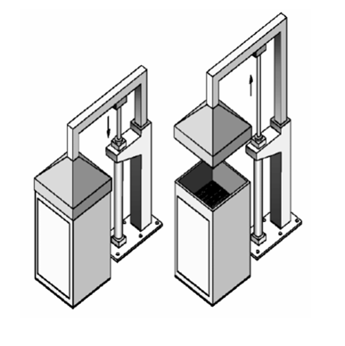
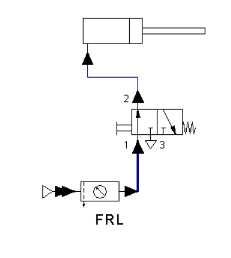
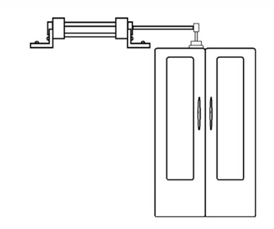
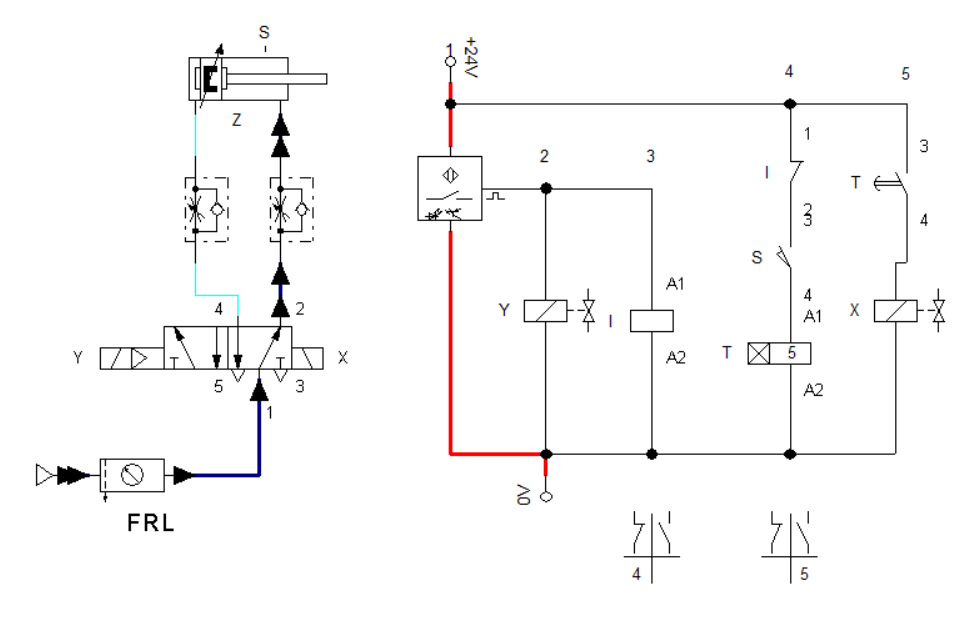

# Fluid Power Systems — Hydraulic & Pneumatic Circuit Design

Design and simulation of hydraulic and pneumatic control systems for industrial applications using **FluidSIM** software. Covers single- and double-acting cylinders, directional control valves, solenoid-operated circuits with ladder diagrams, and electro-pneumatic relay logic with sensor-based automation.

> **Course:** Hydraulic & Pneumatic Control (MEC2307)  
> **Institution:** Helwan National University — Robotics & Mechatronics Department  
> **Supervisor:** Dr. Ahmed Kadry  
> **Team:** Yousef Ahmed Elbeltagy · Mohamad Sherif Shabrawy

---

## Part 1 — Hydraulic Circuits (FluidSIM-H)

Three industrial hydraulic applications designed and simulated. Each application has two parts: **(a)** manual lever-actuated valve and **(b)** solenoid-operated valve with electrical ladder diagram.

---

### Application 1 — Hardening Furnace Cover

A **single-acting cylinder** raises and lowers a furnace cover. A **10 kg load (98.1 N)** acts as the natural return force when hydraulic pressure is released.

| Part | Valve | Control |
|---|---|---|
| (a) | 3/2 lever-actuated, spring-return | Manual lever |
| (b) | 3/2 solenoid-operated, spring-return | Pushbutton + solenoid Y + ladder diagram |



*Solenoid-operated circuit (1b) — hydraulic flow path (red) from HPU through 3/2 valve to single-acting cylinder. Ladder diagram on the right shows pushbutton E energizing solenoid Y.*

**Operation:**
- **Extend (Cover Raises):** Button pressed → solenoid Y ON → valve shifts P→A → pressurized fluid enters cylinder → piston extends upward against the 10 kg load
- **Retract (Cover Lowers):** Button released → spring returns valve A→T → pressure relieved → gravity (98.1 N) pulls piston back down

---

### Application 2 — Furnace Door Control

A **double-acting cylinder** opens and closes a furnace door. Spring-return valve provides fail-safe behavior — the door automatically closes if power is lost.

| Part | Valve | Control |
|---|---|---|
| (a) | 4/2 lever-actuated, spring-return | Manual lever |
| (b) | 4/2 solenoid-operated, spring-return | Pushbutton + solenoid Y + ladder diagram |


*Solenoid-operated circuit (2b) — double-acting cylinder controlled by dual-solenoid 4/2 valve. Red shows pressurized flow; ladder diagram shows interlocked control of solenoids X and Y.*

**Operation:**
- **Extend (Door Opens):** Button pressed → solenoid Y → P→B, A→T → fluid enters rod side → piston extends, door opens
- **Retract (Door Closes):** Released → spring return → P→A, B→T → piston retracts, door closes automatically

---

### Application 3 — U-Shape Bending Device

A **double-acting cylinder** performs U-shape bending on sheet metal. Uses a **4/2 dual-solenoid valve without spring return** — the valve holds position until the opposite solenoid fires. Flow control valves regulate speed on both ports.



*Industrial hydraulic press / U-shape bending machine — cylinder extends to stamp workpiece, retracts to eject.*



*Sorting device mechanism — illustrates the physical arrangement of the cylinder and actuated components.*

| Component | Description |
|---|---|
| Valve | 4/2 solenoid (X and Y) — no spring return |
| Pushbutton E1 | Energizes solenoid X → advance stroke (bending) |
| Pushbutton E2 | Energizes solenoid Y → return stroke |
| Flow control valve (Port A) | Regulates advance stroke speed |
| Flow control valve (Port B) | Regulates return stroke speed |

---

## Part 2 — Pneumatic Circuits (FluidSIM-P)

Two industrial pneumatic applications — from basic pushbutton control to a fully automated electro-pneumatic system with sensors and relay logic.

---

### Application 1 — Industrial Transport System

A **single-acting pneumatic cylinder** pushes goods from a storage shelf onto a transfer belt. Simple, reliable, and designed for high-frequency repetitive operations.


*Physical setup — cylinder pushes goods horizontally from the storage shelf onto the conveyor belt.*

| | Extension Stroke | Return Stroke |
|:---:|:---:|:---:|
| **Circuit** |  |  |
| **State** | Button pressed → valve shifts 1→2 → air flows (blue) → cylinder extends | Button released → valve returns 2→3 → air exhausted (cyan) → spring retracts |

| Component | Description |
|---|---|
| Single-acting cylinder | Extends under compressed air, retracts via internal spring |
| 3/2 pushbutton valve (NC, spring-return) | Supplies air when pressed, exhausts when released |
| FRL Unit | Filter–Regulator–Lubricator — conditions compressed air |

---

### Application 2 — Automatic Pneumatic Door Control

A **fully automated electro-pneumatic door** using a double-acting cylinder with optical proximity sensor, end-position sensor, timer, and relay-based control logic. The door opens on detection, stays open safely, and closes automatically after a 5-second delay.



*Double-acting cylinder mounted above the door — extends to open, retracts to close.*

#### Circuit Stages

**Stage 1 — Door Opens (Person Detected)**


*Proximity sensor activated → relay Y energized → solenoid Y ON → 5/2 valve shifts → cylinder extends (blue flow path). Timer is blocked by relay Y — door cannot close while person is present.*

**Stage 2 — 5-Second Timer (Person Left)**


*Person leaves → relay Y de-energized → end-position sensor S confirms full extension → timer T starts counting (shown as 3.6s in screenshot). Door stays open during delay.*

**Stage 3 — Door Closes (Timer Expires)**



*Timer finishes → relay X energized → solenoid X ON → valve reverses → cylinder retracts → door closes. System resets automatically.*

#### Full Sequence

```
1. Person detected  → proximity sensor ON → relay Y energized → solenoid Y ON
                     → valve shifts → cylinder extends → door OPENS
                     → timer BLOCKED (door stays open safely)

2. Person present   → relay Y active → door HOLDS OPEN

3. Person leaves    → proximity sensor OFF → relay Y de-energized
                     → end-position sensor (S) confirms full extension
                     → timer T starts (5-second delay)

4. Timer counts 5s  → door remains open (safe exit time)

5. Timer expires    → relay X energized → solenoid X ON
                     → valve reverses → cylinder retracts → door CLOSES

6. System resets    → sensors reset → timer resets → ready for next cycle
```

| Component | Description |
|---|---|
| Double-acting cylinder | Opens and closes door under air pressure |
| 5/2 directional control valve | Dual-solenoid (X and Y) — controls flow direction |
| Optical proximity sensor | Detects person approaching |
| End-position sensor (S) | Confirms cylinder fully extended before timer starts |
| Timer (T) | 5-second delay before closing |
| Relay Y | Keeps door open, blocks timer while person present |
| Relay X | Activates return stroke after timer finishes |
| Power Supply | 24V DC |

---

## Repository Structure

```
fluid-power-systems-fluidsim/
├── hydraulics/
│   ├── circuits/
│   │   ├── app1a_furnace_cover_manual.ct        # App 1a — single-acting, 3/2 lever valve
│   │   ├── app1b_furnace_cover_solenoid.ct      # App 1b — solenoid + ladder diagram
│   │   ├── app2a_furnace_door_manual.ct         # App 2a — double-acting, 4/2 lever valve
│   │   ├── app2b_furnace_door_solenoid.ct       # App 2b — solenoid + ladder diagram
│   │   ├── app3_bending_device.ct               # App 3 — U-shape bending, dual solenoid
│   │   ├── double_acting_cylinder_demo.ct
│   │   ├── single_acting_cylinder_demo.ct
│   │   └── sorting_device_demo.ct
│   └── docs/
│       ├── images/                              # Circuit screenshots
│       └── Hydraulics_Report.pdf
├── pneumatics/
│   ├── circuits/
│   │   ├── app1_transport_system.ct             # App 1 — single-acting, 3/2 pushbutton
│   │   ├── app2_door_control.ct                 # App 2 — automatic door, relay logic
│   │   └── app2_door_control_v2.ct
│   └── docs/
│       ├── images/                              # Circuit screenshots
│       └── Pneumatics_Report.pdf
└── README.md
```

> **Software:** FluidSIM-H (hydraulics) and FluidSIM-P (pneumatics) — `.ct` files open directly in FluidSIM

---

## Tools & Concepts

- **FluidSIM-H / FluidSIM-P** — Circuit design and simulation
- **Hydraulic components:** Single/double-acting cylinders, 3/2 and 4/2 directional control valves, flow control valves, HPU (motor + pump + relief valve)
- **Pneumatic components:** Single/double-acting cylinders, 3/2 and 5/2 valves, FRL units, proximity sensors, end-position sensors, timers
- **Control methods:** Manual lever actuation, solenoid-operated valves, ladder diagrams, relay logic, electro-pneumatic automation
