# Fluid Power Systems — Hydraulic & Pneumatic Circuit Design

Design and simulation of **3 hydraulic** and **2 pneumatic** industrial control systems using **FluidSIM** software. Each system is first designed with a manual valve, then upgraded to solenoid-operated control with a full electrical ladder diagram.

> **Course:** Hydraulic & Pneumatic Control (MEC2307)  
> **Institution:** Helwan National University — Robotics & Mechatronics Department  
> **Supervisor:** Dr. Ahmed Kadry  
> **Team:** Yousef Ahmed Elbeltagy · Mohamad Sherif Shabrawy

---

# Part 1 — Hydraulic Systems (FluidSIM-H)

---

## Application 1 — Hardening Furnace Cover

A **single-acting cylinder** raises and lowers a hardening furnace cover. A **10 kg load (98.1 N)** is attached to the rod — it simulates the real weight of the cover and acts as the natural return force when hydraulic pressure is released (no spring needed).

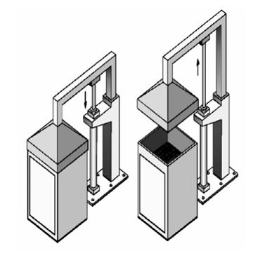

### Part (a) — Manual Control: 3/2 Lever-Actuated Valve

| ▲ Extension — Cover Raises | ▼ Return — Cover Lowers |
|:---:|:---:|
| 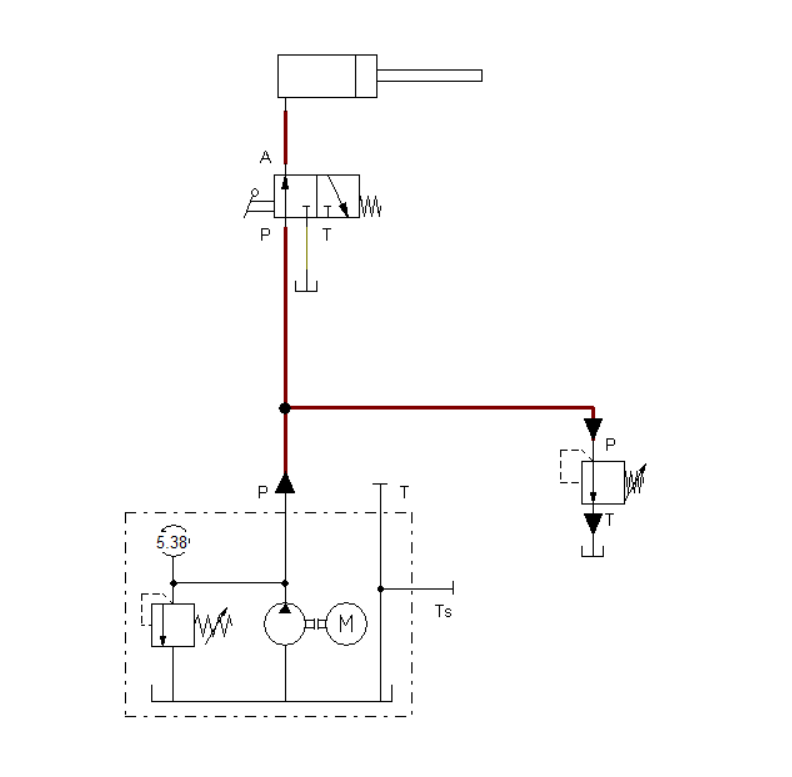 | 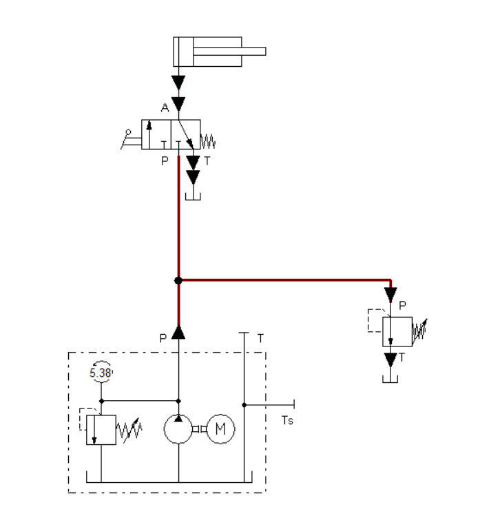 |
| Lever actuated → valve shifts P→A → fluid flows (red) into cylinder → piston extends upward against the 10 kg load | Lever released → spring returns valve A→T → pressure relieved → 10 kg load pulls piston back down by gravity |

### Part (b) — Solenoid Control: 3/2 Solenoid Valve + Ladder Diagram

| ▲ Extension — Cover Raises | ▼ Return — Cover Lowers |
|:---:|:---:|
| 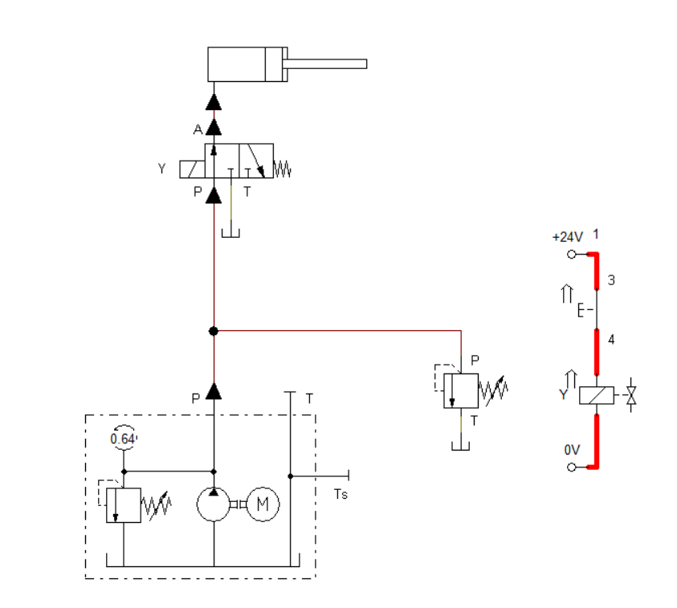 |  |
| Pushbutton pressed → solenoid Y energized (red ladder path active) → valve shifts P→A → fluid enters cylinder → cover raises | Button released → solenoid Y de-energized → spring returns valve → pressure relieved → 10 kg load lowers cover |

---

## Application 2 — Furnace Door Control

A **double-acting cylinder** opens and closes a furnace door. Unlike App 1, hydraulic pressure is used in **both directions** — the door is actively opened AND closed. The spring-return valve provides **fail-safe behavior**: the door automatically closes if power is lost.

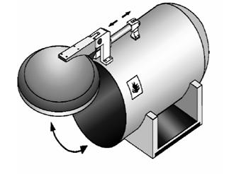

### Part (a) — Manual Control: 4/2 Lever-Actuated Valve

| ▶ Extension — Door Opens | ◀ Return — Door Closes |
|:---:|:---:|
| 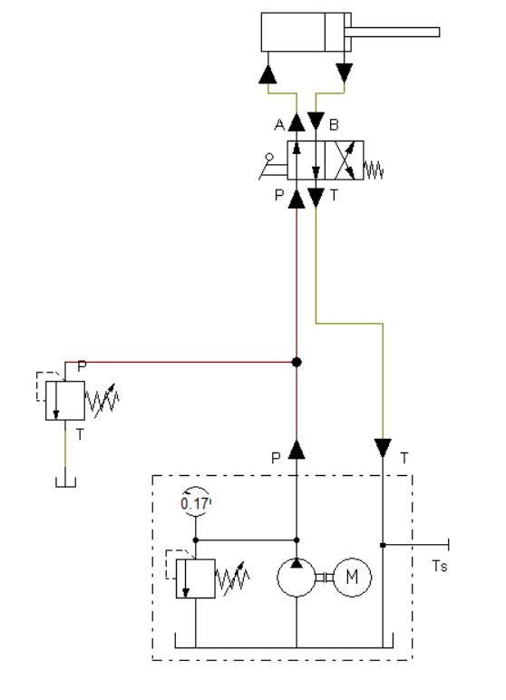 | 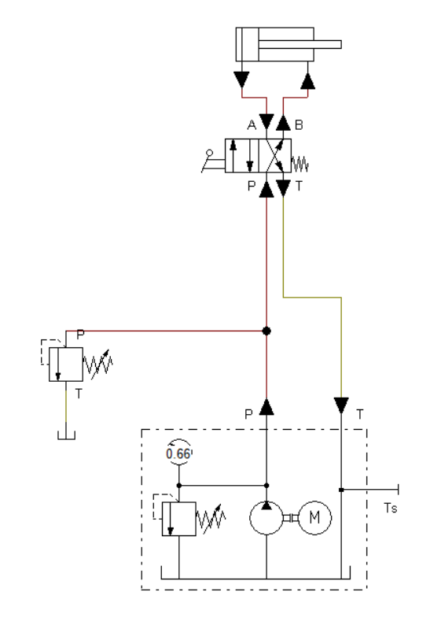 |
| Lever actuated → valve shifts P→B, A→T → fluid enters rod side (red) → piston extends → door opens. Yellow line shows return oil to tank | Lever released → spring returns valve P→A, B→T → fluid now enters blank end → piston retracts → door closes automatically |

### Part (b) — Solenoid Control: 4/2 Solenoid Valve + Ladder Diagram

| ▶ Extension — Door Opens | ◀ Return — Door Closes |
|:---:|:---:|
| 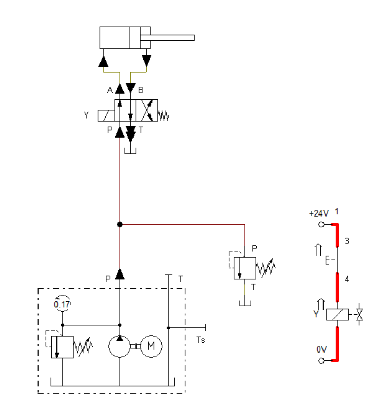 | 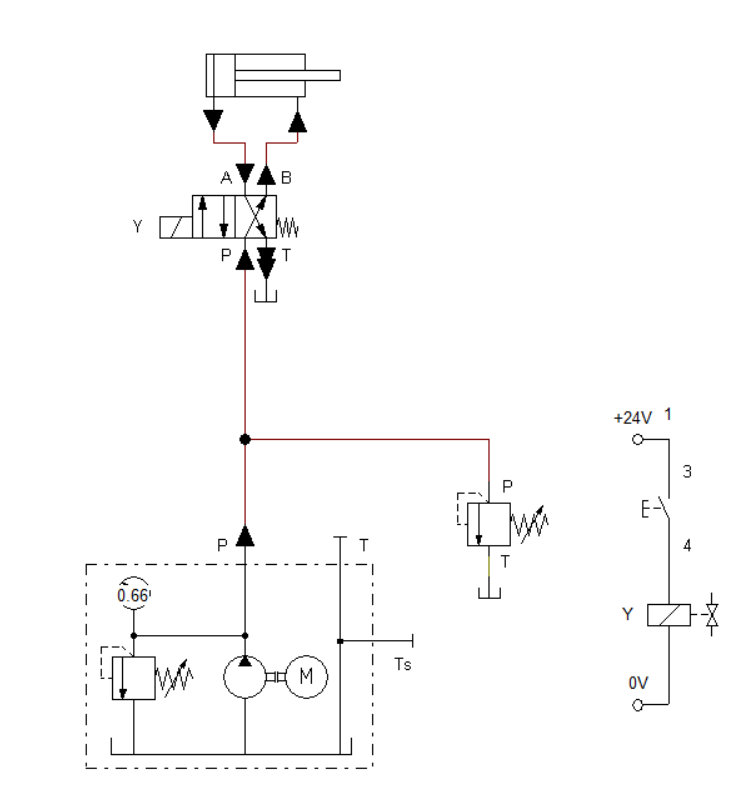 |
| Pushbutton pressed → solenoid Y energized (red ladder path active) → valve shifts P→B → fluid enters rod side → door opens | Button released → solenoid Y de-energized → spring returns valve P→A → fluid enters blank end → door closes |

---

## Application 3 — U-Shape Bending Device

A **double-acting cylinder** performs a U-shape bending operation on sheet metal. This is the most advanced application: uses a **4/2 dual-solenoid valve with no spring return** — the valve holds its last position until the opposite solenoid fires. Two independent pushbuttons control each stroke, and **flow control valves** regulate speed on both ports for precise bending.


| ▼ Advance Stroke — Bending Operation | ▲ Return Stroke — Cylinder Retracts |
|:---:|:---:|
| 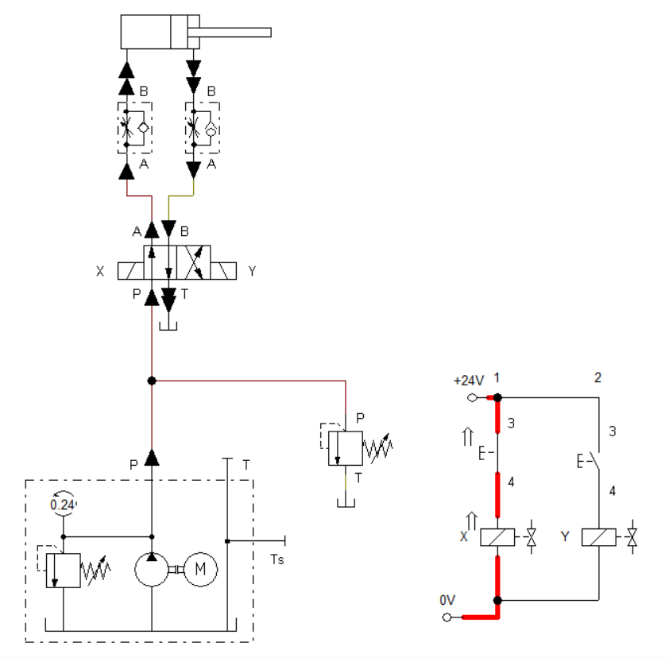 | 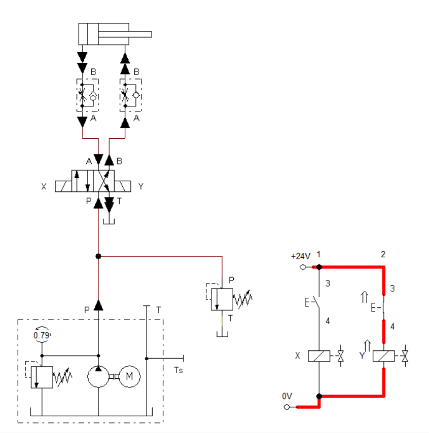 |
| Press E1 → solenoid X energized (rung 1 active, red) → valve shifts P→A → fluid flows through flow control valve (slow speed) into blank end → cylinder extends → sheet metal bent | Press E2 → solenoid Y energized (rung 2 active, red) → valve shifts P→B → fluid flows through flow control valve (slow speed) into rod side → cylinder retracts to start position |

> **Key difference from Apps 1 & 2:** The valve has **no spring return** — it latches in position. The cylinder holds the bent workpiece until E2 is pressed.

---

# Part 2 — Pneumatic Systems (FluidSIM-P)

---

## Application 1 — Industrial Transport System

A **single-acting pneumatic cylinder** pushes goods from a storage shelf onto a transfer belt. Simple, reliable, and designed for high-frequency repetitive operations. The cylinder extends under compressed air and retracts automatically via its **internal spring** — no second control signal needed.

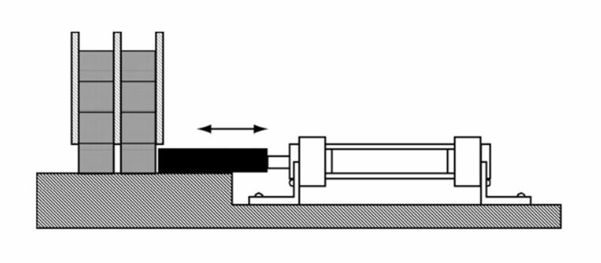

| ▶ Extension — Goods Pushed | ◀ Return — Spring Retract |
|:---:|:---:|
|  | 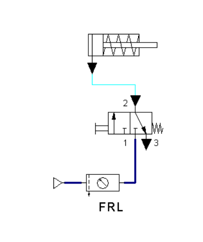 |
| Button pressed → 3/2 valve shifts port 1→2 → compressed air flows (blue) through FRL into cylinder → piston extends → goods pushed onto belt | Button released → valve returns port 2→3 (exhaust) → air vented to atmosphere (cyan) → internal spring pulls piston back automatically |

---

## Application 2 — Automatic Pneumatic Door Control

A **fully automated electro-pneumatic door system** using a double-acting cylinder. The system detects people via an optical proximity sensor, holds the door open safely while they pass, and closes automatically after a **5-second timer delay**. No human input required after initial setup.


### Stage 1 — Person Detected → Door Opens

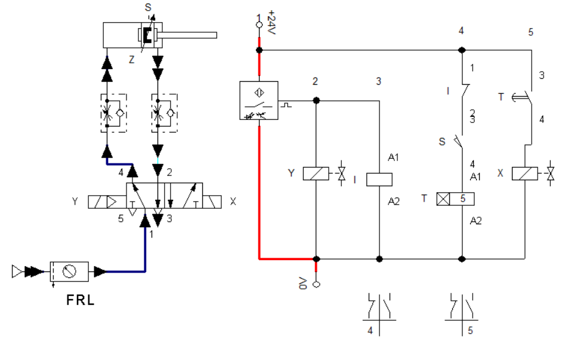

Proximity sensor detects a person → relay Y energizes → solenoid Y activates → 5/2 valve shifts → compressed air extends cylinder (blue flow path) → door opens. Relay Y simultaneously **blocks the timer** — the door cannot close while someone is present.

### Stage 2 — Person Leaves → 5-Second Timer Starts

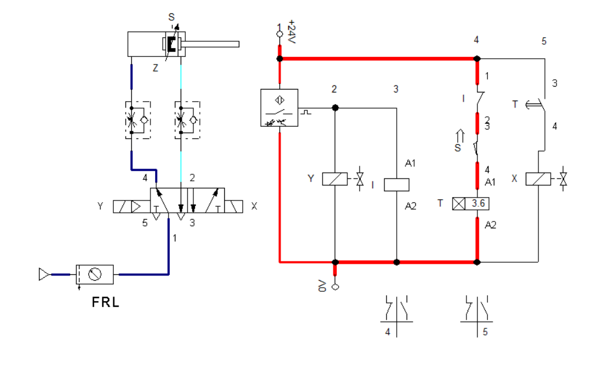

Person leaves → proximity sensor OFF → relay Y de-energizes → end-position sensor S confirms cylinder is fully extended → timer T begins counting (5 seconds). Door stays open during the full delay — safe exit time guaranteed.

### Stage 3 — Timer Expires → Door Closes


Timer reaches 5 seconds → relay X energizes → solenoid X activates → 5/2 valve reverses → air enters other side of cylinder → piston retracts → door closes. System resets automatically, ready for the next person.

**Full sequence summary:**
```
Person detected  →  Door OPENS  →  Timer BLOCKED (safe hold)
Person leaves    →  5s timer starts  →  Door stays open (safe exit)
Timer expires    →  Door CLOSES  →  System RESETS
```

---

## Repository Structure

```
fluid-power-systems-fluidsim/
├── hydraulics/
│   ├── circuits/
│   │   ├── app1a_furnace_cover_manual.ct        # App 1a — 3/2 lever valve
│   │   ├── app1b_furnace_cover_solenoid.ct      # App 1b — 3/2 solenoid + ladder
│   │   ├── app2a_furnace_door_manual.ct         # App 2a — 4/2 lever valve
│   │   ├── app2b_furnace_door_solenoid.ct       # App 2b — 4/2 solenoid + ladder
│   │   ├── app3_bending_device.ct               # App 3 — dual solenoid + flow control
│   │   ├── double_acting_cylinder_demo.ct
│   │   ├── single_acting_cylinder_demo.ct
│   │   └── sorting_device_demo.ct
│   └── docs/
│       ├── Hydraulics_Report.pdf
│       └── images/                              # 13 circuit screenshots
├── pneumatics/
│   ├── circuits/
│   │   ├── app1_transport_system.ct             # App 1 — 3/2 pushbutton valve
│   │   ├── app2_door_control.ct                 # App 2 — automatic door, relay logic
│   │   └── app2_door_control_v2.ct
│   └── docs/
│       ├── Pneumatics_Report.pdf
│       └── images/                              # 7 circuit screenshots
└── README.md
```

> **Software:** FluidSIM-H (hydraulics) and FluidSIM-P (pneumatics) — `.ct` files open directly in FluidSIM

---

## Key Concepts Covered

| Concept | Where Applied |
|---|---|
| Single-acting cylinder + gravity return | Hydraulics App 1 |
| Double-acting cylinder + spring-return valve (fail-safe) | Hydraulics App 2 |
| Dual-solenoid valve with no spring return (latching) | Hydraulics App 3 |
| Flow control valves for speed regulation | Hydraulics App 3 |
| Solenoid valves + ladder diagrams | All hydraulic Part (b) circuits |
| Single-acting cylinder + pneumatic spring return | Pneumatics App 1 |
| Electro-pneumatic automation (sensor + relay + timer) | Pneumatics App 2 |
| Proximity sensor + end-position sensor + timer interlock | Pneumatics App 2 |
